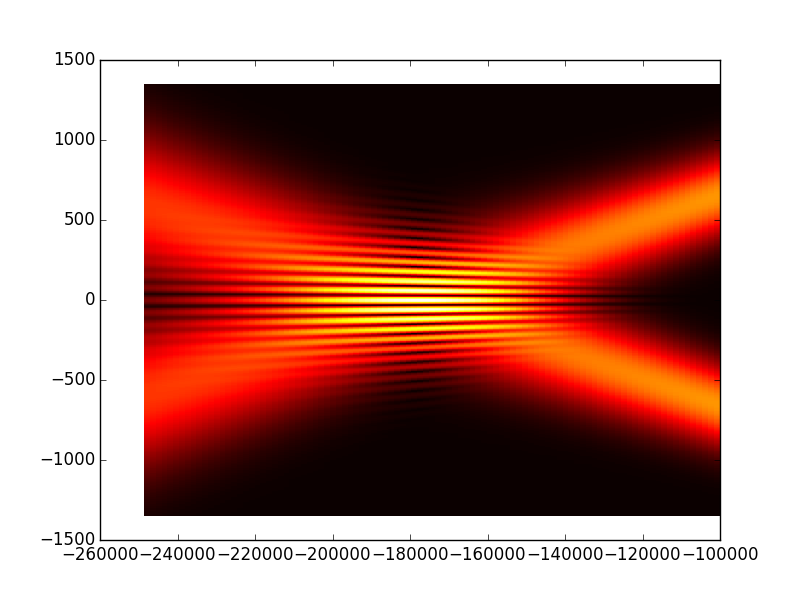
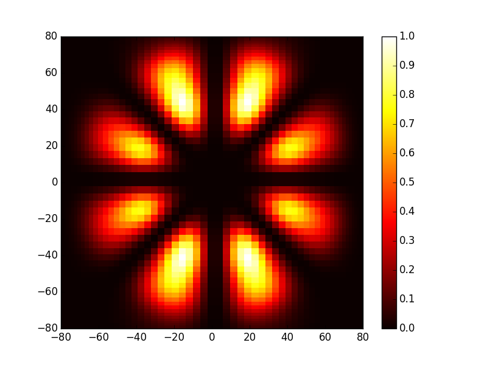
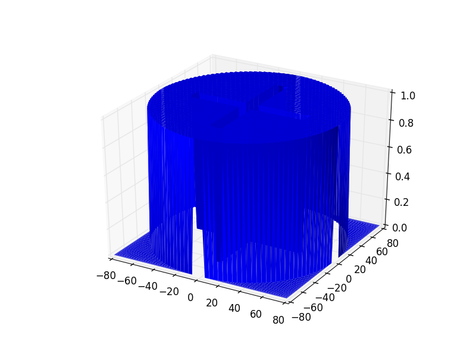
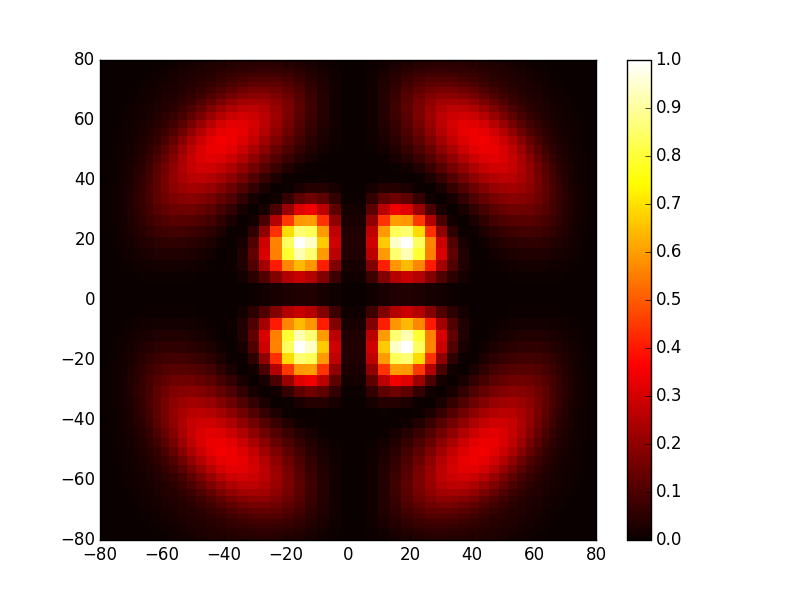

Introduction
============

*OpenCavity*  uses the matrix method with Fresnel Kernel formulation, plus an eigenvalue solver to find the fundamental mode of a laser cavity plus the higher order ones.
In addition to the mode solver, it contains Physical optics module (Fresnel propagator) for general 1D and 2D systems, and also 
an 1D/2D Gaussian beam generator.  

Thanks to its general systems definition, the package can be used as a tool to :
     - simulate and understand laser cavities physics.
     - design & optimization to study the effect of 
               - aberrations.
               - thermal lens.
               - intra-cavity phase/amplitude elements (aperture, phase mask...) 
               - misalignment of optical elements... 

The physical optics module with the Gaussian beam generator can be used as a tool to study beam propagation through optical systems (paraxial case), this can be useful fore example to:
     - design & study interference and interferometers. 
     - beam transformation using phase/amplitude elements. (lens, axicon, aperture, spatial light modulators ...etc)
     - high order Gaussian beams propagation through optical systems.
  

Installation, Python & dependencies

We choose `python <https://www.python.org/>`_ programming language to write *OpenCavity* because it is powerful, fast and multi-platform (windows /Linux /Mac Os). It is also friendly, easy to learn, open source with very important and active community, and a lot of useful packages. 
*OpenCavity* package like most scientific python softwares, needs  `scipy <http://scipy.org/>`_ and `numpy <http://numpy.org/>`_ for fast matrix manipulation, and linear algebra calculations. It also depends on *matplotlib* package for 1D and 2D plots.

Once you have Python and required packages installed, you can download *opencavity* from `releases page <https://github.com/seghil/OpenCavity/releases>`_  and install it.

If you are new to python the next section is for you, we will see how to install python and the needed dependencies for *OpenCavity* package. However we will see just the minimum required for start using *OpenCavity*, to learn more about python there are plenty of excellent tutorials on the web, and the official python `website <https://www.python.org/>`_ would be a good place where to start.

.. image:: _static/python-logo.png
.. image:: _static/numpylogo.png
.. image:: _static/scipy-logo.png
.. image:: _static/matplotlib-logo.png

Gallery
-------

Some figures from the tutorials 

.. image:: _static/tuto6_plot_propagate_tem00_2D_I.png
   :width: 2.5in 
   

   
.. image:: _static/tuto6_plot_tem01_I_2D.png
   :width: 2.5in 
    

   

   
.. image:: _static/tuto9_plot_interference_I.png
   :width: 2.5in     

.. image:: _static/Bessel_cavity_scheme2.png
   :width: 3.5in    
   
.. image:: _static/schema_interfero_donut.png
   :width: 3.5in       
   
.. image:: _static/Optical_cavity_aperture.png
   :width: 3.5in  
   
.. image:: _static/tuto6_plot_tem03_I_2D.png
   :width: 2.5in 
   
.. image:: _static/tuto5_plot_tem03_yz_1D.png
   :width: 2.5in 
       
.. image:: _static/tuto9_plot_arm1_P.png
   :width: 2.5in 
        
