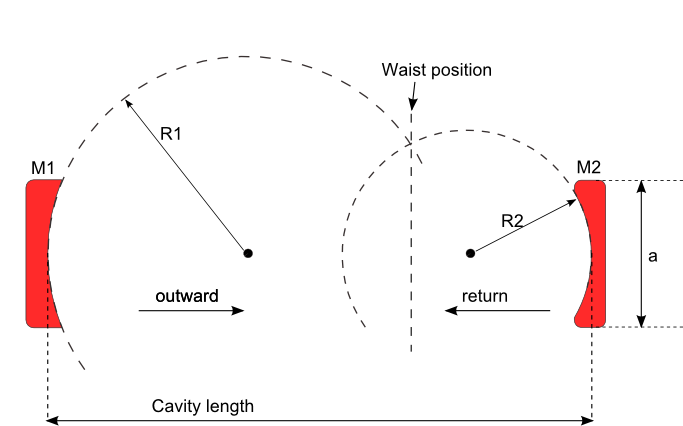

************************************
Tutorial 1 - Simple 2 mirrors cavity
************************************

System definition
=================

In this example we see how to calculate the eigenmodes of a simple 2 mirrors optical resonator (see Fig below) 

Where M1, M2 are two mirrors with radius of curvature R1,R2 respectively, and Lc the distance between M1,M2 is the cavity length.
It is important to note that the sign convention adopted is R>0 means concave mirror and R<0 means a convex one. We consider
a plano-concave cavity also called VECSEL type cavity, for Vertical Cavity Surface Emitting lasers which means that the waist is on 
the plane mirror.
 
This is the simplest example one can get, Well let's see how to calculate the eigenmodes of this cavity:

.. ipython::

   In [1]: import opencavity.modesolver as ms; #importing the opencavity module
   
   #creating an empty system at wavelength =1.01, this will contain all the problem parameters
   In [2]: sys=ms.CavEigenSys(wavelength=1.01); 
   
   In [3]: R1=1e13; R2=10*1e3; Lc=8*1e3; npts=120; a=150; # defining the cavity parameters 
   
   In [4]: sys.build_1D_cav(a, npts, R1, R2, Lc); # building the matrix-kernel system
   
   In [5]: sys.solve_modes(n_modes=10); # solve the 10 first modes of the cavity, default value of n_modes is 30
   
- in the first command we import the **CavityMode** module  and we call it ``oc`` in the running session, the ``;`` is used to not show messages. 
- in the command 2 we create a *opencavity* object working at a wavelength=1.01, this object will contain all the system (parameters, solutions...) note that:
      - the default wavelength is 1, this means that ``sys=ms.CavEigenSys()`` = ``sys=ms.CavEigenSys(wavelength=1)``
      - the wavelength is unitless, thus all distances are in the wavelength unit. (here micron)
- in line 3 we just enter the cavity parameters.
- in line 4 we build the Fresnel-kernel matrix of the system.
- in line 5 we ask the solver to find the 10 first eigenvalues and modes of the cavity in 'sys', note that 
   - the default value of ``n_modes`` is 30.
   
Now to see the calculated modes and eigenvalues:

.. ipython::
   
   @savefig plot_mode0_E_1D.png width=4in
   In [6]: sys.show_mode(0); #plot the E-field of the 1st mode.
   
   @savefig plot_mode1_I_1D.png width=4in
   In [7]: sys.show_mode(1,what='intensity'); #plot the intensity of the 2d mode.
   
   @savefig plot_mode1_P_1D.png width=4in
   In [8]: sys.show_mode(1,what="phase");  #plot the phase of the 2nd mode.
   
The calculated eigenmodes and eigenvalues are in ``sys``, to get them:

.. ipython::

   In [9]: l,v=sys.get_mode1D(0) # l is the eigenvalue, and v the eigenvector: complex E-field of the mode
   
   In [9]: print(1-ms.np.abs(l)**2) # the round trip losses = 1- |l|^2, we use np numerical-python imported within the oc
  
  
In this example we used the function ``buid_1D_cav()`` to build the cavity `kernel`,  this function is appropriate for simple systems like the one of this tutorial when we have linear 2 mirrors cavity. However, there is a more general and powerful function which is ``build_1D_cav_ABCD()`` which can be used to define any optical cavity using its transfer matrix. (see :ref:`_ray-matrices-label`). In the forthcoming tutorials we will use this function, including the next one which is a tutorial that aim at getting familiar with defining general cavity designs.

To summarize, the steps one should do to define a cavity systems and find its modes using ``opencavity`` can be summarized as follows:

   - importing ``opencavity`` module 
   - enter the cavity parameters
   - create a solver object (CavEigenSys()) that keeps in one place  all informations about the system
   - solve the mode 
   - show the modes 

To end, we note that there are two very useful features when using ``spyder``: auto-completion by hitting ``tab`` key after the point, such as for ``sys.``, this gives all the available functions in the class. And when you are not sure how to use a given function, you can hit ``Ctl+i`` to show the function help in the object inspector. 
   
The cleaned code
================

.. literalinclude::  tuto_source/tuto_1_1D_2mirrors.py
