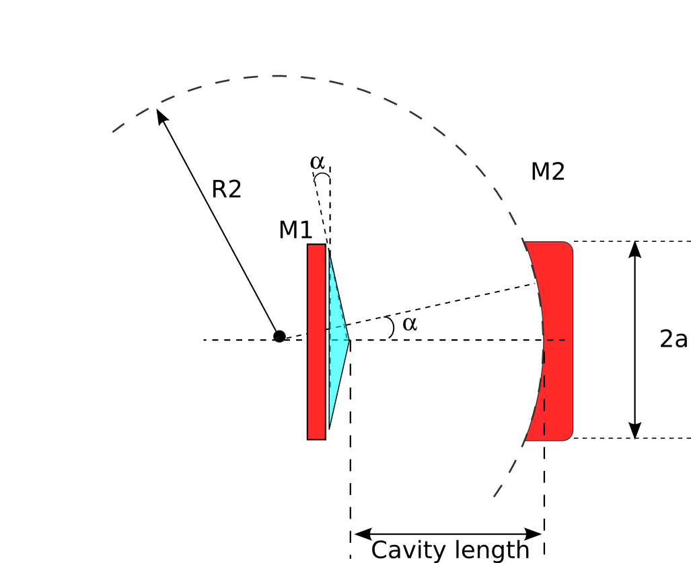

.. _label-tuto6:

**************************************************
Tutorial 6 - A second 'Bessel-Gauss' cavity design
**************************************************

In the previous cavity design we used a divergent conical reflector which is equivalent to a negative refractive axicon, let's tray now to use a positive 
axicon. Then we calculate the output beam by considering that the output coupler is the concave mirror and using the method explained in :ref:`tuto4-label`, 
by assuming that the thickness of the output mirror d1 is 5mm for example, we take n1=1.5 the refractive index of the output mirror. The output plane 
where we want to see the beam is at a distance d2= 100mm from the output mirror second facet. But first let's start with defining the cavity.

The new design scheme is shown bellow: 

.. _Bessel-cavity2-fig:

Creating the ABCD matrices and the cavity-subsystems just as in the previous tutorial:

.. ipython::
   
   In [1]: import opencavity.modesolver as ms
   
   In [1]: from opencavity.propagators import FresnelProp
   
   In [1]: import numpy as np #import numerical Python
   
   In [1]: import matplotlib.pylab as plt # import matplotlib to plot figures 
    
  
   
   In [1]: R1=1e18; R2=250*1e3; Lc=78*1e3; npts=500; a=2000; # cavity parameters
   
   In [1]: M1=np.array([[1,0 ],[-2/R1, 1]]); M2=np.array([[1, Lc],[0, 1]]); #plane mirror M1 & propagation distance Lc
   
   In [1]: M3=np.array([[1, 0],[-2/R2, 1]]); M4=np.array([[1, Lc],[0, 1]]); #concave mirror M2 &propagation distance Lc
   
   In [1]: M11=M2.dot(M1); M22=M4.dot(M3); # sub-system 1 & sub-system 2 
   
   In [1]: A11=M11[0,0]; B11=M11[0,1]; C11=M11[1,0]; D11=M11[1,1] # getting the members of subsystem 1 matrix
   
   In [1]: A22=M22[0,0]; B22=M22[0,1]; C22=M22[1,0]; D22=M22[1,1] # getting the members of subsystem 2 matrix

   In [1]: sys1=ms.CavEigenSys(wavelength=1.04); # working wavelength 1.04 micron
    
   In [1]: sys2=ms.CavEigenSys(wavelength=1.04);
   
   In [1]: sys1.build_1D_cav_ABCD(a,npts,A11,B11,C11,D11) #
   
   In [1]: sys2.build_1D_cav_ABCD(a,npts,A22,B22,C22,D22) #  
   
   
Creating the axicon function with `positive` base angle = +0.5°, ``sys.k`` is the wave vector, the only difference with the first example is the sign 
of the base angle.

.. ipython::
   
   In [1]: theta=0.5*3.14/180;# reflector is equivalent to refractive axicon with 2 x theta
   
   In [1]: T_axicon=ms.np.exp((1j*sys1.k)*2*theta*(ms.np.sign(sys1.x1))*sys1.x1)

Applying the axicon function and solve and show the fundamental mode

.. ipython::
   
   In [1]: sys1.apply_mask1D(T_axicon)

   In [1]: sys1.cascade_subsystem(sys2)

   In [1]: sys1.solve_modes()
   
   @savefig tuto6_plot_tem00_I_1D.png width=3.5in
   In [1]: sys1.show_mode(0,what='intensity')

The first thing we notice is that the ring radius of the beam is smaller. But the major difference is in the propagation. let's calculate now the output 
beam at d2=10cm out of the cavity. The propagation system to calculate the output beam is shown bellow:

.. _Bessel-output-fig:

.. image:: _static/Bessel2_output.png
   :width: 5in
   :align: center

creating the propagation matrix, fetching the mode and propagate it. The ABCD matrix of such a optical system is: 

.. math::
      \begin{bmatrix} A & B \\ C & D \end{bmatrix}=
      \begin{bmatrix} 1 & d2 \\ 0 & 1 \end{bmatrix} 
      \times \begin{bmatrix} 1 & 1 \\ 0 & n1/n0 \end{bmatrix}
      \times \begin{bmatrix} 1 & d1 \\ 0 & 1 \end{bmatrix}
      \times \begin{bmatrix} 1 & 0 \\ \frac{(n0-n1)}{R2*n1} & n0/n1 \end{bmatrix}
      \times \begin{bmatrix} 1 & Lc \\ 0 & 1 \end{bmatrix}

Entering ABCD matrices
 
.. ipython:: 

   In [1]: import opencavity as ms
   
   In [1]: from opencavity.propagators import FresnelProp
   
   In [1]: import numpy as np #import numerical Python
   
   In [1]: import matplotlib.pylab as plt # import matplotlib to plot figures 
    
   
   
   In [1]: R1=1e18; R2=250*1e3; Lc=78*1e3; npts=500; a=2000; # cavity parameters

   In [1]: M00=np.array([[1,Lc ],[0, 1]]);
   
   In [1]: M01=np.array([[1,0 ],[(1-1.5)/(-R2*1.5), 1/1.5]]);# -R2  (<0 because it is a concave interface)
   
   In [1]: M02=np.array([[1,5e3 ],[0, 1]]);
   
   In [1]: M03=np.array([[1,1 ],[0, 1.5/1]]);
   
   In [1]: M04=np.array([[1,100e3 ],[0, 1]]);
   
   In [1]: M_out=M04.dot(M03.dot(M02.dot(M01.dot(M00))));

Propagating the beam

.. ipython::    

   In [1]: propsys2=FresnelProp() # create propagator object
   
   In [1]: l,tem00=sys1.get_mode1D(0) # get the fundamental mode of the cavity 
   
   In [1]: propsys2.set_start_beam(tem00, sys1.x1) # set the beam to propagate
   
   In [1]: propsys2.set_ABCD(M_out) # set the ABCD matrix 
   
   In [1]: propsys2.propagate1D_ABCD(x2=sys1.x1) # calculate the propagation

   @savefig tuto6_plot_bessel_out_1D_I.png width=4in
   In [1]: propsys2.show_result_beam(what='intensity') # show propagation result

The beam radius remain almost unchanged!. To figure out how this beam propagates when he leaves the cavity we take the result of the propagation which is the beam at 100mm then we go back and 
propagate it from -100mm (just after the second mirror) to -50mm (See scheme bellow).

.. _Bessel-output2-fig:

.. image:: _static/Bessel_output2.png
   :width: 4.5in
   :align: center

.. ipython:: 
   
   In [1]: U,x=propsys2.get_result_beam() # get the beam resulting from last propagation
   
   In [1]: propsys2.set_start_beam(U, x) # set this beam as a starting one
   
   In [1]: propsys2.yz_prop_chart(-100e3,-50e3,100,0.5*sys1.x1) # propagate at several successive planes 
   
   In [1]: plt.set_cmap('hot') #change the colormap (see 'matplotlib' help)

   @savefig tuto6_plot_bessel_out_yz_I.png width=4.5in
   In [1]: propsys2.show_prop_yz() # show the result
   
Well its more clear now, the high intensity region is just at the output of the cavity.

The cleaned code
================

.. literalinclude::  tuto_source/tuto_6_bessel_gauss2.py
